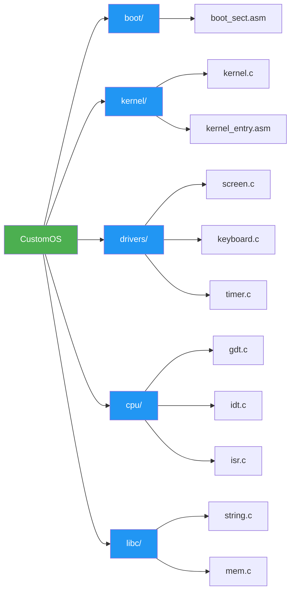

# 🖥️ CustomOS

<div align="center">

**A minimal x86 operating system built from scratch**


</div>

---

## 💭 Philosophy

> *"If you want to truly understand how computers work, build your own operating system."*
> 
> This project is my journey into systems programming. Feel free to learn from it, modify it, and make it your own. **All I ask is that you share your knowledge with others as freely as it was shared with you.**

---

## 📖 About

CustomOS is an educational operating system written in **x86 Assembly** and **C**. This is a learning project to understand OS fundamentals: bootloaders, protected mode, interrupts, and hardware drivers.

---

## ✨ Features

- ⚙️ Custom 16-bit bootloader
- 🚀 32-bit protected mode kernel
- 📺 VGA text mode driver (80x25, 16 colors)
- ⌨️ PS/2 keyboard driver (US QWERTY layout)
- ⏱️ PIT timer driver (18.222 Hz)
- 🔔 Interrupt handling (ISRs and IRQs)
- 📚 Basic standard library functions

---

## 🏗️ Architecture

### Project Structure


```mermaid
Boot Sequence
sequenceDiagram
    autonumber
    participant BIOS
    participant Bootloader
    participant Kernel
    participant Hardware
    
    BIOS->>Bootloader: Load from disk (sector 0)
    Note over Bootloader: Real Mode (16-bit)
    Bootloader->>Bootloader: Load kernel from disk
    Bootloader->>Bootloader: Setup GDT
    Bootloader->>Bootloader: Switch to Protected Mode
    Note over Bootloader: Protected Mode (32-bit)
    Bootloader->>Kernel: Jump to kernel entry point
    Kernel->>Kernel: Initialize IDT
    Kernel->>Hardware: Initialize drivers
    Note over Kernel,Hardware: VGA, Keyboard, Timer
    Kernel->>Kernel: Enter main loop
    loop Event Loop
        Hardware->>Kernel: Hardware interrupt
        Kernel->>Hardware: Handle interrupt
    end
```
Memory Layout
graph TB
    A[0x00000000<br/>Real Mode IVT]
    B[0x00007C00<br/>Bootloader]
    C[0x00001000<br/>Kernel]
    D[0x000B8000<br/>VGA Memory]
    E[0xFFFFFFFF<br/>End]
    
    A --> B
    B --> C
    C --> D
    D --> E
    
    style A fill:#FF5722,color:#fff
    style B fill:#FF9800,color:#fff
    style C fill:#4CAF50,color:#fff
    style D fill:#2196F3,color:#fff
    style E fill:#9E9E9E,color:#fff
```

🚀 Getting Started
Prerequisites
<details>
<summary><b>Ubuntu/Debian</b></summary>

sudo apt-get update
sudo apt-get install nasm gcc qemu-system-x86 make
</details>

<details>
<summary><b>macOS</b></summary>

brew install nasm i686-elf-gcc qemu make
</details>

<details>
<summary><b>Arch Linux</b></summary>

sudo pacman -S nasm gcc qemu make
</details>

Build and Run
# Clone the repository
git clone https://github.com/yourusername/CustomOS.git
cd CustomOS

# Build the OS
make

# Run in QEMU
make run

# Clean build files
make clean

📂 Directory Structure
CustomOS/
│
├── 📁 boot/                  # Bootloader code
│   └── boot_sect.asm         # 16-bit bootloader (512 bytes)
│
├── 📁 kernel/                # Kernel code
│   ├── kernel.c              # Main kernel logic
│   └── kernel_entry.asm      # Kernel entry point
│
├── 📁 drivers/               # Hardware drivers
│   ├── screen.c              # VGA text mode driver
│   ├── keyboard.c            # PS/2 keyboard driver
│   └── timer.c               # PIT timer driver
│
├── 📁 cpu/                   # CPU-related code
│   ├── gdt.c                 # Global Descriptor Table
│   ├── idt.c                 # Interrupt Descriptor Table
│   └── isr.c                 # Interrupt Service Routines
│
├── 📁 libc/                  # Standard library
│   ├── string.c              # String functions
│   └── mem.c                 # Memory functions
│
├── Makefile                  # Build system
└── README.md                 # This file

🎯 Roadmap
gantt
    title CustomOS Development Roadmap
    dateFormat YYYY-MM
    section Phase 1
    Bootloader & Kernel     :done, 2024-01, 2024-02
    VGA & Keyboard Drivers  :done, 2024-02, 2024-03
    section Phase 2
    Memory Management       :active, 2024-03, 2024-05
    Shell Interface         :2024-05, 2024-07
    section Phase 3
    File System             :2024-07, 2024-10
    Multitasking            :2024-10, 2025-01
Current Progress:

 Bootloader and kernel setup
 Protected mode switch
 VGA driver
 Keyboard driver
 Timer driver
 Interrupt handling
 Memory management (paging)
 Shell with commands
 Simple file system
 Process support
 Multitasking


📚 Learning Resources

📖 OSDev.org - Comprehensive OS development wiki
📘 Intel Software Developer Manuals - Official x86 reference
📕 "Operating Systems: Design and Implementation" by Andrew S. Tanenbaum
📙 "Operating System Concepts" by Silberschatz, Galvin, Gagne


🤝 Contributing
This is a personal learning project, but contributions are welcome! 
Feel free to:

🐛 Report bugs
💡 Suggest features
🔧 Submit pull requests
📖 Improve documentation


📄 License
MIT License - see LICENSE file for details.

📬 Contact
GitHub: @yourusername

<div align="center">

Made with ☕ and lots of debugging
⭐ Star this repo if you found it helpful!
</div>
```
